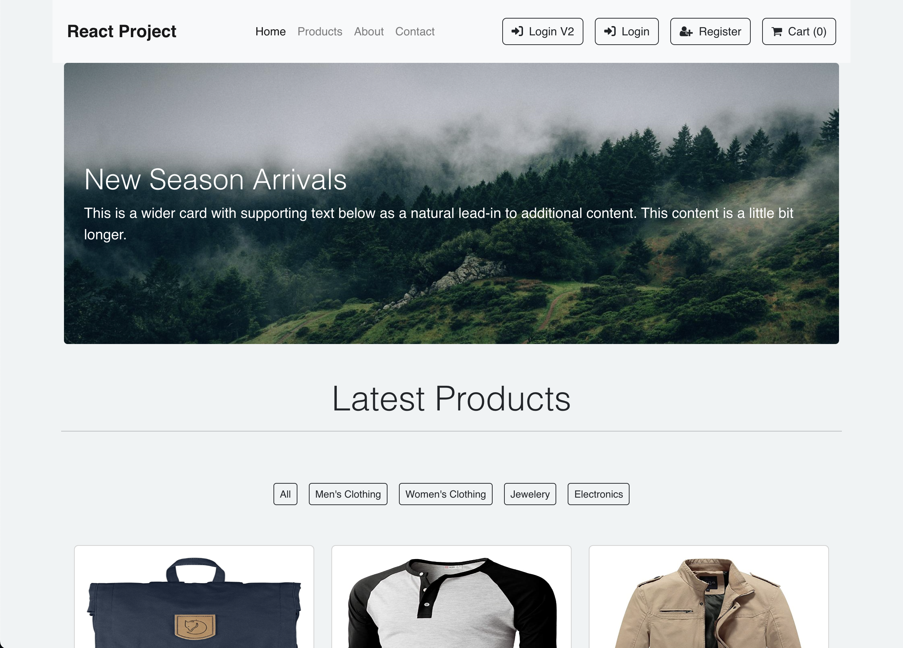
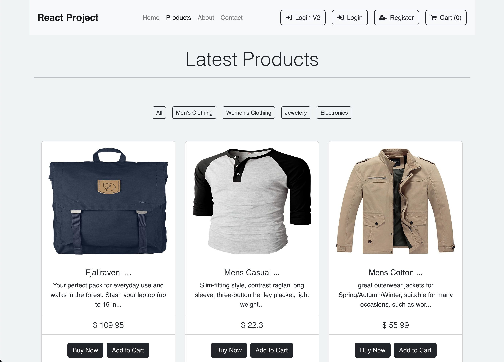
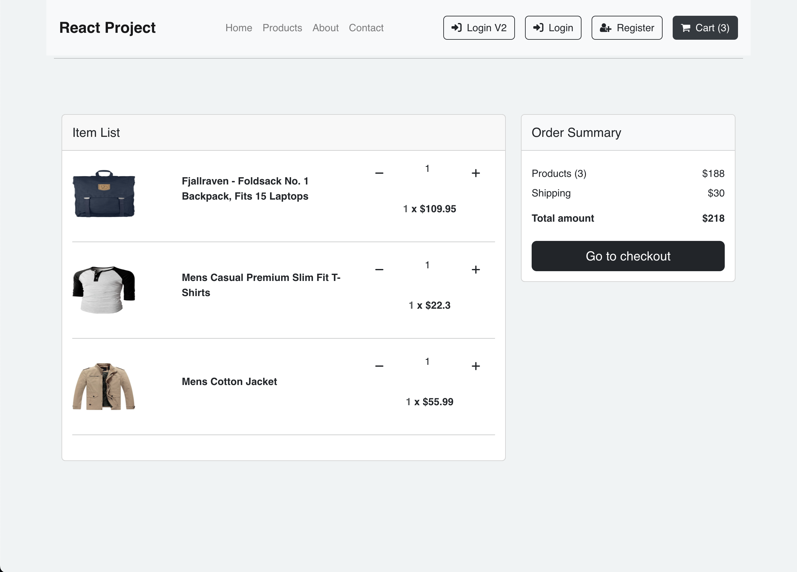
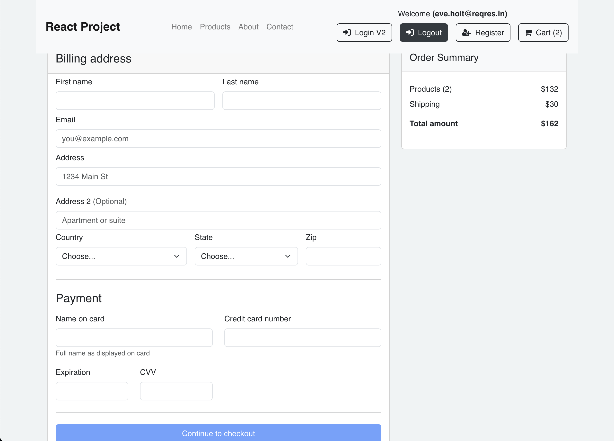
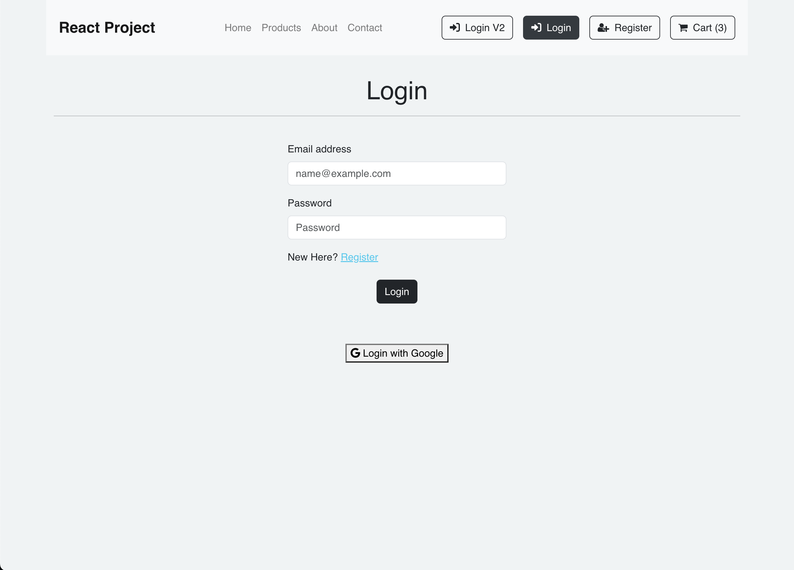
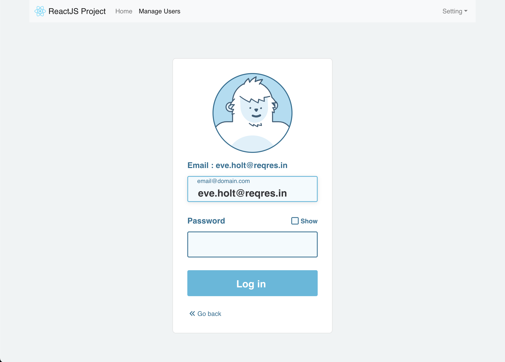
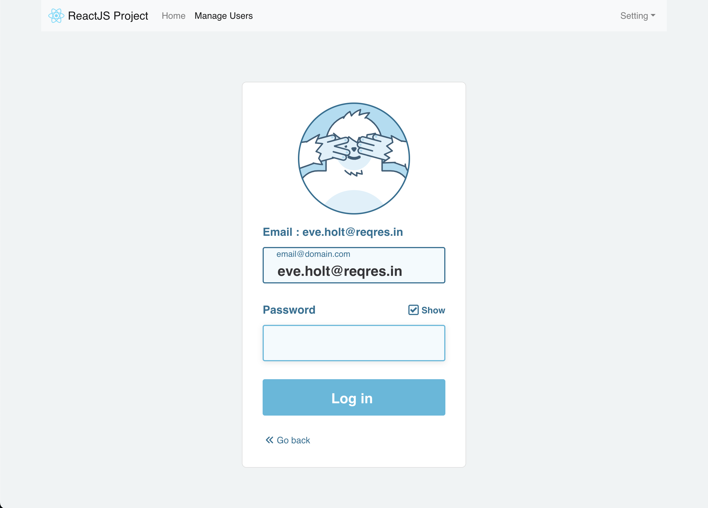
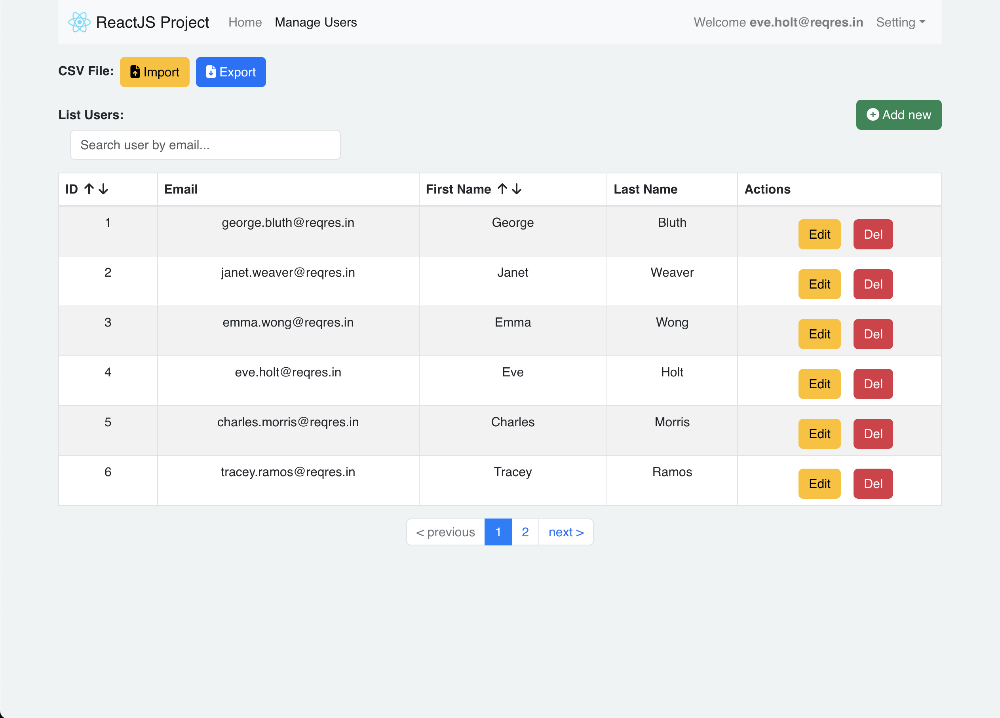

# E-Commerce Website

A Ecommerce Website made with React.js Framework and other.

## Features

- Easy to integrate with Backend
- Fully Responsive
- Easily expand and improve features
- Can integrate technologies from 3rd parties
- Capable of further development to suit commercialization

## Screenshots

        

## Run Locally

Install dependencies

```bash
  npm i
  or
  npm install
```

Start the server

```bash
  npm start
```

## Tech Stack

- [React](https://reactjs.org/)
- [React-Bootstrap](https://react-bootstrap.netlify.app/)
- [Redux](https://redux.js.org/)
- [Bootstrap](https://getbootstrap.com/)
- [FontAwesome](https://fontawesome.com/)
- [Fake Store API](https://fakestoreapi.com/)
- [Firebase](https://firebase.google.com/)
- [Lodash](https://lodash.com/)
- [ErrorBoundaries](https://legacy.reactjs.org/docs/error-boundaries.html)
- [Paginate](https://www.npmjs.com/package/react-paginate)
- [React-Toastify](https://www.npmjs.com/package/react-toastify)
