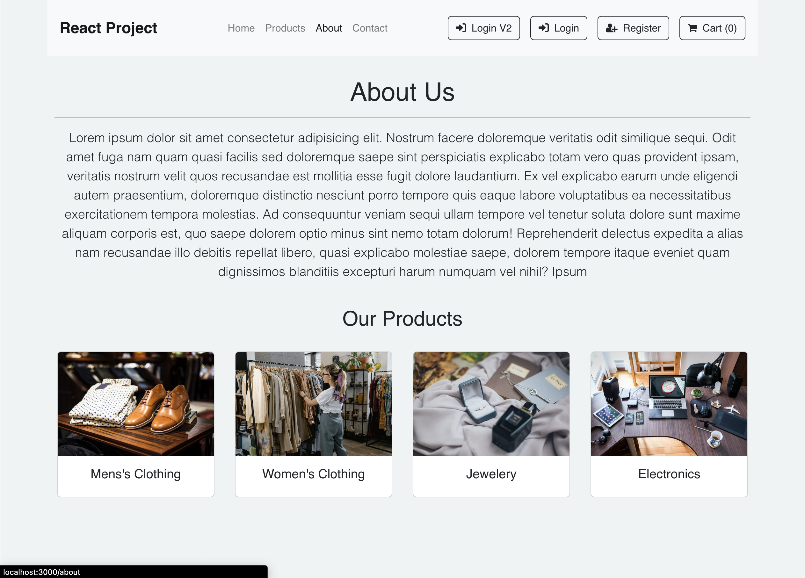

# E-Commerce Website

A Ecommerce Website made with React.js Framework.

## Features

- Easy to integrate with Backend
- Fully Responsive

## Screenshots

       

## Run Locally

Install dependencies

```bash
  npm i
  or
  npm install
```

Start the server

```bash
  npm start
```

## Tech Stack

- [React](https://reactjs.org/)
- [Redux](https://redux.js.org/)
- [Bootstrap](https://getbootstrap.com/)
- [Fake Store API](https://fakestoreapi.com/)
- [Firebase](https://firebase.google.com//)
